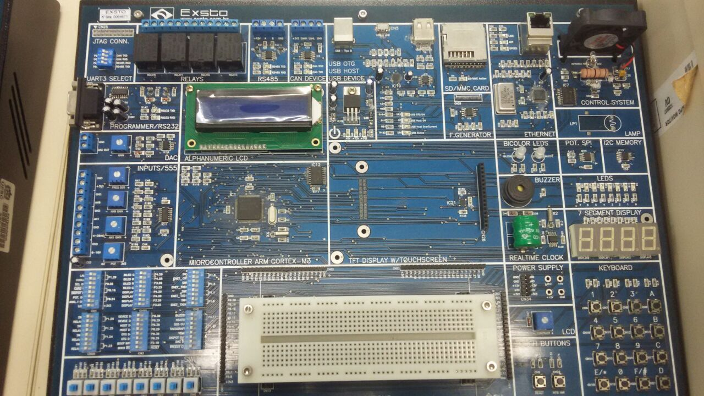

# Universidade Federal de Santa Catarina
## Embedded Digital Systems

### Nome dos Alunos 

* Matheus Francisco Batista Machado
* Luan Rodrigues
* Morgana Sartor
* Marcelly Homem Coelho

Implementações de bibliotecas para utilizar o kit arm cortex M3. As
implementações realizadas aqui foram feitas jutnamente com o professor
<a href="https://github.com/fabiorochaufsc/">Fabio de la Rocha</a>

### Bibliotecas desenvolvidas
##### Digital

Digital é uma biblioteca onde pode utilizar os pinos do kit ARM

As seguintes implementações foram realizadas
* digitalRead
* digitalWrite
* pinMode

##### Delay
##### Uart
##### LCD
##### Timer
##### Interrupção
##### Teclado
##### i2c Software
##### Deselvovimento Sistema de Arquivo

Desenvolver um sistema de arquivo para o kit ARM e LINUX utilizando a biblioteca i2c desenvolvida juntamente com o professor da disciplina.
<a href="">Documentação do trabalho</a>

